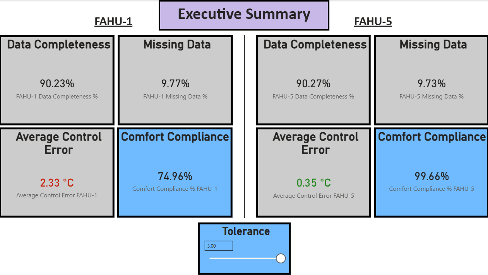

# BMS Operational Analytics Dashboard – Dual FAHU Performance (January 2026)

## Overview

This project presents a Power BI dashboard analyzing operational performance of two Fresh Air Handling Units (FAHU-1 and FAHU-5) using Building Management System (BMS) time-series data.

The dashboard evaluates temperature control, ventilation behavior, humidity regulation, and overall data quality using 5-minute interval operational signals.

---

## Dataset

- **Source:** BMS export files
- **Sampling Frequency:** 5-minute intervals (288 readings per day)
- **Systems Analyzed:** FAHU-1 and FAHU-5
- **Time Period:** January 2026
- **Signals Included:**
  - Supply Air Temperature (SaTemp)
  - Return Air Temperature (RaTemp)
  - Supply Air Humidity (SaHumidity)
  - CO₂ Levels (RaCO2)
  - Fan VFD Commands
  - Setpoints
  - Equipment Status Signals
  - Chilled Water Valve Position
  - Additional operational parameters

---

## Objectives

- Analyze temperature control performance against setpoints
- Evaluate ventilation responsiveness to CO₂ concentration
- Assess humidity regulation relative to comfort thresholds
- Quantify system-wide data completeness
- Implement structured data cleaning and validation methodology

---

## Tools & Techniques Used

- Power BI
- DAX Measures
- Power Query (ETL)
- Time-Series Analysis
- Data Completeness Modeling (Actual vs Expected Row Logic)
- System-Level Aggregation Across Multiple Units

---

## Dashboard Structure

### 1. Executive Summary
High-level system performance overview and key insights.

### 2. Temperature Control
Evaluation of supply air temperature against setpoint.
Assessment of control accuracy and modulation behavior.

### 3. Ventilation & CO₂ Analysis
Scatter analysis of CO₂ levels versus exhaust fan command.
Assessment of ventilation responsiveness.

### 4. Humidity Performance
Comparison of supply air humidity against setpoint.
Comfort band visualization (30%–60% range).

### 5. Data Quality & Cleaning
System data completeness modeling.
Actual vs expected row analysis across both FAHUs.
Structured ETL and validation documentation.

---

## Key Metrics

- System Data Completeness %
- Total Expected Readings
- Total Actual Readings
- Missing Data %
- CO₂ Distribution Trends
- Supply Air Temperature Deviation
- Humidity Compliance Relative to Comfort Band

---

## Key Findings

- CO₂ levels remained within acceptable limits despite non-modulating exhaust fan behavior.
- Supply air humidity remained consistently below the setpoint (~55%), averaging approximately 44–48%.
- Temperature control performance maintained acceptable operational range.
- System-level data completeness exceeded 90%, confirming dataset reliability for performance analysis.

---

## Data Cleaning & Preparation Approach

- Removed hidden and irrelevant files during ingestion.
- Standardized column names across both FAHU datasets.
- Converted timestamp fields to proper DateTime format.
- Enforced consistent data types across all operational parameters.
- Aligned both datasets to a unified 5-minute time structure.
- Implemented DAX measures to calculate actual vs expected readings.
- Validated data completeness prior to performance analysis.

---

## Screenshots

_Add dashboard screenshots here._

Example format:

---

## Project Purpose

This project demonstrates structured time-series analysis, system-level metric modeling, and applied HVAC operational analytics using real-world BMS data.

It reflects applied data engineering principles, analytical modeling, and dashboard design best practices within a building systems context.
